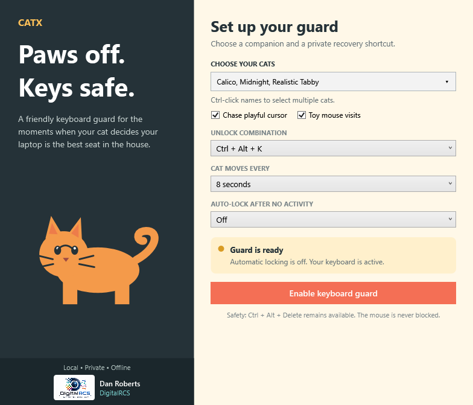
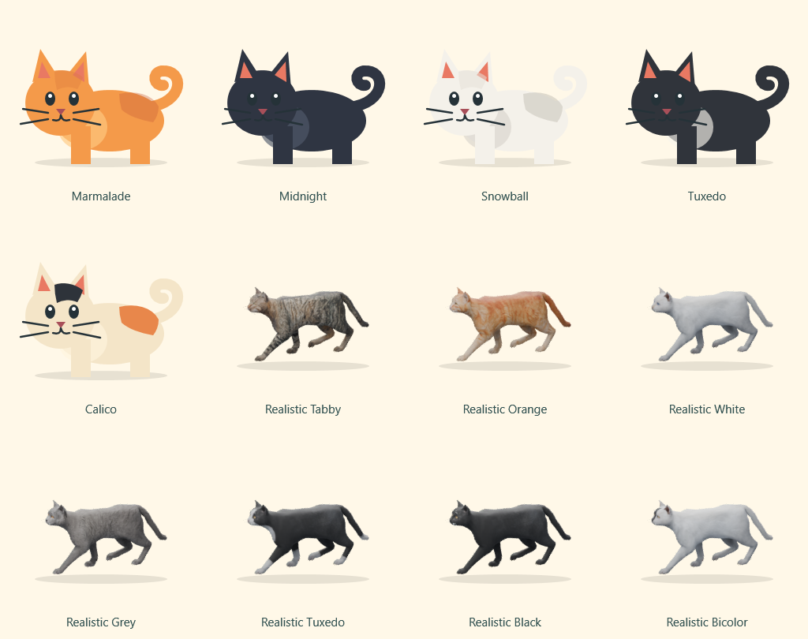
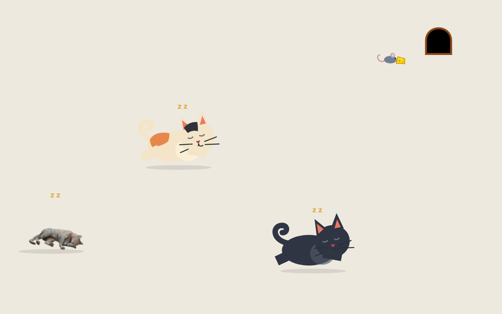

# CatX

CatX is a friendly Windows 11 keyboard guard for anyone whose cat believes a keyboard is a heated bed. When the guard is enabled, ordinary keyboard input is ignored until you hold your chosen recovery shortcut. While the keys are guarded, your chosen animated cats wander, play, and nap around the desktop.


[](https://github.com/digitalrcs/CatX/actions/workflows/build.yml)

## Download and use

1. Open the [latest CatX release](https://github.com/digitalrcs/CatX/releases/latest).
2. Download `CatX-Windows11-<version>.zip`, extract all files, and run `Setup.exe` for a normal Windows installation. The standalone installer and portable build may also be provided separately.
3. Launch CatX on a 64-bit Windows 11 PC.
4. Choose your cats, recovery shortcut, and movement interval.
5. Press **Enable keyboard guard** and immediately test the displayed shortcut.

CatX is currently distributed as an unsigned community application. Windows SmartScreen may show **Windows protected your PC** on first launch. Confirm that the publisher is unknown, select **More info**, and choose **Run anyway** only if the download came from this repository. A future release may be code-signed.

## Meet CatX

Set up your cats and keyboard guard in one simple window.



**Twelve personalities to choose from.** Mix original illustrated cats and realistic coats; Ctrl-click up to eight names in the dropdown.



**A little life on your desktop.** Cats find their own nap spots while one shared mouse gathers cheese and brings it home. This staged scene uses the application's actual renderer.



Visit the **[CatX wiki](https://github.com/digitalrcs/CatX/wiki)** for a quick start, illustrated guides, and troubleshooting.

## Features

- Blocks ordinary keyboard input with a Windows low-level keyboard hook.
- Offers three user-selectable recovery shortcuts.
- Includes five original vector cat styles: Marmalade, Midnight, Snowball, Tuxedo, and Calico.
- Adds seven realistic cats rendered in Blender: Tabby, Orange, White, Grey, Tuxedo, Black, and Bicolor. Blender is not needed at runtime.
- Open **Choose your cats** and Ctrl-click up to eight cat names in the dropdown. It stays open for multiple choices; **No cats / clear selection** gives keyboard-only protection. Enable the keyboard guard to show the selected cats.
- During natural play, awake cats occasionally approach companions and pause to greet them with a heart before resuming their own activities. Cursor play, toys, and naps take priority.
- All cats can walk, sit, groom, nap anywhere with separate reserved spots, and get excited by quick cursor direction changes.
- One shared mouse seeks a visible piece of cheese, picks it up, and carries it home. Cats can run after it and catch it; the mouse sometimes dodges them and delivers the cheese. A catch gets a playful celebration, and a successful delivery shows **+1 cheese**. Both play behaviors can be switched off.
- The Preview cats button and preview-action selector have been removed. Cats use natural behavior automatically. The local `--review` mode disables the guard and leaves saved preferences unchanged.
- Includes a **No cat** preference for keyboard-only protection.
- Animates a click-through cat within the working area of the monitor where the cursor was when the cat started, including monitors with negative coordinates.
- Lets you choose how often the cat changes location.
- Can automatically enable the guard after an optional inactivity period; keyboard or mouse activity resets the timer.
- Saves preferences locally in `%LOCALAPPDATA%\CatX\settings.json`.
- Makes no network requests, requires no account, and collects no data.
- Keeps the mouse usable and cannot block Windows' secure `Ctrl + Alt + Delete` screen.
- Minimizes to a cat icon in the Windows notification area with Open, Disable keyboard guard, and Exit commands.

> [!IMPORTANT]
> Test your recovery shortcut before leaving CatX enabled. If needed, use the mouse to select **Disable guard with mouse**, close CatX, or press `Ctrl + Alt + Delete` and use Windows' secure screen.

## Run from source

Requirements: Windows 11 and the [.NET 8 SDK](https://dotnet.microsoft.com/download/dotnet/8.0).

```powershell
git clone https://github.com/digitalrcs/CatX.git
cd CatX
dotnet run --project .\src\CatX\CatX.csproj
```

CatX does not require administrator privileges.

## Build a single Windows executable

```powershell
dotnet publish .\src\CatX\CatX.csproj `
  --configuration Release `
  --runtime win-x64 `
  --self-contained true `
  --output .\publish
```

The self-contained executable will be `publish\CatX.exe`. It includes the .NET runtime, so the destination PC does not need .NET installed.

## How the safety model works

CatX installs its keyboard hook only after you press **Enable keyboard guard** or the selected auto-lock inactivity period expires. While the guard is inactive, CatX reads Windows' last-input timestamp; any keyboard or mouse activity resets the countdown. It does not record input content or mouse positions. Because guarded modifier events are themselves suppressed, CatX tracks Ctrl, Alt, and Shift directly from the low-level hook rather than relying on Windows' post-event key state. The selected recovery chord is checked before the final key event is suppressed. When it matches, CatX immediately removes the hook and restores normal input. Closing the application also removes the hook.

Windows handles `Ctrl + Alt + Delete` outside normal user applications, so CatX cannot suppress it. CatX intentionally never blocks the mouse. It does not run as a service, start with Windows, or persist a lock after the process exits.

Minimizing CatX hides its taskbar button and keeps it running in the Windows notification area. Right-click the cat icon to reopen CatX, disable an active keyboard guard, or exit the application. Double-clicking the icon also reopens the window.

## Project layout

```text
src/CatX/
  Models/              Preferences and unlock-chord definitions
  Services/            Keyboard guard and local settings storage
  CatOverlayWindow.*   Click-through animated desktop cat
  MainWindow.*         Settings and guard controls
tests/CatX.Tests/      Recovery-chord regression tests
```

## Contributing

Bug reports and pull requests are welcome. Please read [CONTRIBUTING.md](CONTRIBUTING.md) before making a change. For security concerns, follow [SECURITY.md](SECURITY.md).

Additional project information:

- [User guide](docs/USER_GUIDE.md)
- [Printable PDF user guide](output/pdf/CatX-User-Guide-v1.2.0.pdf)
- [GitHub wiki](https://github.com/digitalrcs/CatX/wiki)
- [Windows packaging and signing](docs/PACKAGING.md)
- [Architecture](docs/ARCHITECTURE.md)
- [Troubleshooting](docs/TROUBLESHOOTING.md)
- [Privacy](docs/PRIVACY.md)
- [Roadmap](ROADMAP.md)
- [Changelog](CHANGELOG.md)
- [Support](SUPPORT.md)

## Current limitations

- The release is for 64-bit Windows 11 (`win-x64`). ARM64 is not packaged yet.
- CatX protects the current interactive desktop session; it is not a driver or Windows service.
- Realistic animations are transparent frame sequences baked from the supplied Blender rig. Arbitrary model importing is not exposed in the app.
- Release executables are not currently code-signed.

## Artwork and naming

The five vector cats are original artwork created for this project. Realistic cats use the owner-supplied Blender model and textures; their original asset license remains applicable. See [realistic cats and animation build instructions](docs/ANIMATED_CATS.md). CatX is not affiliated with Garfield, Paws, Inc., or any other fictional-cat property.

## License

CatX source code is available under the [MIT License](LICENSE). The supplied third-party Blender model and its rendered realistic-cat assets are not relicensed under MIT.
